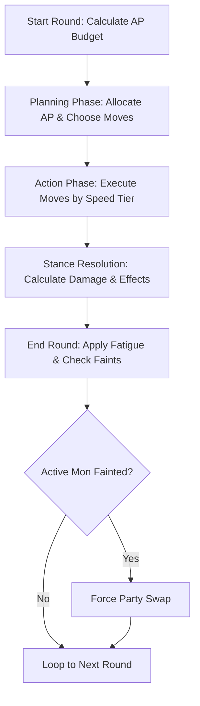

# BattleEngine

> **Status**: In Design
> **Author**: Antigravity
> **Last Updated**: May 28, 2026
> **Implements Pillar**: Playful Stance Battles

## Overview

The `BattleEngine` controls turn-based combat in *Hearth & Horn*. Battles are active, low-stress, 2v2 tactical duels where the player deploys two monster companions to face wild creatures or rival travelers. The combat round operates on a speed-based Action Point (AP) budget, where the player's total round AP is the sum of their active monsters' Speed stats. Moves are spent dynamically from this combined budget. Combat revolves around a predictive move stance triangle (Block, Counter-Block, and Brute Attack) that rewards players for reading the enemy's stance indicators.

## Player Fantasy

The combat system delivers the fantasy of a supportive tactical coach:
*   **Active Partnerships**: Coordinating your two active monsters as a tag team, leveraging one fast attacker and one slow defender to budget your turn AP.
*   **Mind Games & Prediction**: Reading the enemy monster’s physical indicators to predict their stance, then executing a perfect counter-move (e.g., catching a blocking shield-monster with a crushing Counter-Block move).
*   **Playful & Kid-Friendly**: Simplified math, no complex elemental type charts to memorize, and highly readable status indicators like "Blocked!" or "Countered!".

## Detailed Design

### Core Rules & Deployed Combat

1.  **Tag-Team Deployment**: The player carries up to 4 monsters in their travel party. At the start of battle, the first 2 healthy monsters are deployed actively. The other 2 wait in reserve.
2.  **Action Point (AP) Budget**:
    *   Unlike traditional games where each creature gets exactly one action per turn, *Hearth & Horn* uses a shared turn budget.
    *   The total Action Points (AP) available at the start of a combat round is the sum of the Speed stats of the 2 currently active monsters.
    *   *Speed values range from 1 to 3*, yielding a round AP budget between 2 and 6 AP.
    *   Unused AP does not carry over; it is discarded at the end of the round.
3.  **Move Selection and Cost**:
    *   During the Planning Phase, the player allocates AP to moves.
    *   Moves cost either 1 or 2 AP.
    *   The player can allocate all AP to a single active monster (e.g., executing two 2-AP moves with one fast monster while the other stands idle to absorb hits), or split the points between both.
4.  **The Stance Triangle**:
    Every combat move is classified under a specific stance type. Matchups resolve as follows:
    *   **Brute Attack**: Heavy strike. Deals normal damage. Beats Counter-Block. Block reduces its damage to 0.
    *   **Block**: Defensive guard. Reduces all incoming Brute Attack damage to 0. Fails against Counter-Block.
    *   **Counter-Block**: Predictive strike. If targeted at a monster executing a Block stance, it deals double (2.0x) damage. If targeted at a monster in Brute or Idle stance, it fails entirely (deals 0 damage).

#### Stance Matchup Grid

| Attacker Stance | Defender: Idle / Brute | Defender: Block |
| :--- | :--- | :--- |
| **Brute Attack** | Deals 1.0x Damage | Deals 0.0x Damage (Blocked!) |
| **Block** | N/A (Defensive self-buff) | N/A |
| **Counter-Block** | Deals 0.0x Damage (Miss!) | Deals 2.0x Damage (Countered!) |

### Round Resolution Loop

Each combat round progresses through three distinct phases:

1.  **Planning Phase**: The player and the enemy AI select targets and stances. Stance indicators (e.g., enemy holding a shield for Block, or glowing red for Brute) are displayed visually to help the player predict actions.
2.  **Action Phase**: Moves are executed in order of monster speed tiers (Speed 3 moves first, then Speed 2, then Speed 1). If speeds are tied, order is random.
3.  **Stance Resolution**: When a move executes, the engine checks the defender's chosen stance and applies the stance multiplier to the damage output.
4.  **Round End**:
    *   Fatigue is added to all active monsters (+10 fatigue per round, modified by bond level).
    *   Fainted monsters (HP == 0) are removed, and the trainer must choose a replacement from their bench.

## Formulas

### Formula 1: Round Action Points (AP) Budget
Calculates the total AP available to spend on actions in a round:

`round_ap = active_mon_1.speed + active_mon_2.speed`

*   **Variables**:
    *   `speed`: Base Speed stat of the monster (range: 1–3).
*   **Output Range**: `2` to `6` AP.

### Formula 2: Battle Damage Calculation
Calculates raw damage dealt by an attacking move:

`damage = base_power * (attacker.attack / defender.defense) * stance_multiplier * combat_stat_modifier`

**Variables:**
| Variable | Symbol | Type | Range | Description |
|----------|--------|------|-------|-------------|
| `base_power` | $P_b$ | int | 10–50 | Base power of the move resource. |
| `attacker.attack` | $A_a$ | int | 10–100 | Attacking stat of the monster (modified by bond level). |
| `defender.defense` | $D_d$ | int | 10–100 | Defense stat of the target monster (modified by bond level). |
| `stance_multiplier` | $M_s$ | float | 0.0, 1.0, 2.0 | Matchup multiplier (see Stance Matchup Grid). |
| `combat_stat_modifier` | $C_m$ | float | 1.0–1.25 | Bond level stat modifier ($1.0 + \text{bond\_level} \times 0.05$). |

*   **Damage Cap**: Minimum damage is `1` (if hits connect). Max damage is capped at `999` to keep calculations within clean bounds for UI display.

## Edge Cases

*   **Fainting Mid-Round**: If Active Mon A has two moves queued but faints during the speed-tier resolution before executing them, the remaining moves are cancelled and the budgeted AP is lost.
*   **Simultaneous Faints**: If both active player monsters faint in the same round, the game pauses and opens the party swap menu. If the reserve party is also empty or fainted, the player is defeated and retreats to the nearest campsite or town.
*   **Stance Tied Priorities**: If both active monsters target a single opponent, and one uses Brute while the other uses Counter-Block:
    *   If the defender is Blocking, the Brute move deals 0 damage, but the Counter-Block move deals 2.0x damage.
    *   Stances resolve individually per strike.
*   **Status Constraints**: A sleeping or exhausted monster (`fatigue == 100`) cannot be deployed. If a monster reaches `fatigue == 100` mid-battle, it falls asleep, immediately ending its active round deployment and forcing a party swap.

## Dependencies

### Upstream Dependencies (What this system requires)
*   **`MonsterData` (Hard Dependency)**:
    *   *Interface*: Reads race, stats (HP, Attack, Defense, Speed), elemental type, signature talent, and moves.
    *   *Purpose*: Combat calculations require static template and runtime instance data to run calculations.

### Downstream Dependents (What requires this system to function)
*   **`BattleUI` (Hard Dependency)**:
    *   *Interface*: Reads active state, HP pools, and current AP budget. Receives event updates to draw animations.
    *   *Purpose*: Displays the visual field of battle, action selectors, and damage values.
*   **`WildAI` (Hard Dependency)**:
    *   *Interface*: Feeds chosen stances and targets to the engine during the Planning Phase.
    *   *Purpose*: Drives enemy behaviors.
*   **`SaveManager` (Hard Dependency)**:
    *   *Interface*: Read/Write.
    *   *Purpose*: Persists modified HP values and accumulated fatigue after battle concludes.

## Tuning Knobs

| Knob Name | Default Value | Safe Range | Affected System | Risk / Extreme Behavior |
| :--- | :--- | :--- | :--- | :--- |
| `COUNTER_MULTIPLIER` | `2.0` | `1.5 - 3.0` | `BattleEngine` | Multiplier for Counter-Block vs Block. Setting it to `3.0` makes prediction high-reward, potentially one-shotting blocking opponents. |
| `ROUND_FATIGUE_GAIN` | `10` | `2 - 25` | `BattleEngine` | Fatigue gained per deployed monster per round. Set to `25` makes monsters exhaust after 4 rounds, making battles extremely short. |

## Visual/Audio Requirements

*   **Visual Assets**:
    *   2D battle backdrop matching the route terrain (e.g. cozy forest clearing, dirt road).
    *   Stance visual cues: Red flame/sparks for Brute, blue shield outline for Block, purple target crosshair for Counter-Block.
    *   Bouncing text popups: `"BLOCKED!"` (white, text bounces down), `"COUNTERED!"` (neon yellow, expands rapidly), `"0"` or `"MISS"` for failed moves.
*   **Audio Assets**:
    *   Energetic chiptune battle music track.
    *   Brute strike: Heavy retro "smack" or crunch.
    *   Block barrier: Soft "ping" or sci-fi energy hum.
    *   Counter-Block shatter: High-pitched "shatter" or glass-break sound.

## UI Requirements

*   **Split AP Meter**:
    *   A horizontal bar displaying up to 6 light-up crystals representing the round AP.
    *   As the player hovers over moves, the corresponding crystals flash to show projected cost before clicking to confirm.
*   **Health and Stance Indicators**:
    *   Each active monster displays a name tag, a health bar, and a current stance icon badge.
    *   Enemy stance indicators are partially displayed or suggested by physical animations (e.g., an enemy turtle retreats into its shell, suggesting a Block stance).

## Acceptance Criteria

*   **AP Budget Calculation**: GIVEN the player deploys Active Mon 1 (Speed 2) and Active Mon 2 (Speed 1), WHEN the combat round begins, THEN the shared Action Point budget is set to exactly 3.
*   **Block Mitigation**: GIVEN an active monster selects a Block stance move, WHEN hit by an opponent's Brute Attack move, THEN the incoming damage is reduced to exactly 0, and a `"BLOCKED!"` indicator displays.
*   **Counter-Block Resolution**: GIVEN an active monster selects a Counter-Block stance move targeting an opponent, WHEN the opponent uses a Block stance move, THEN the damage dealt is calculated with a `stance_multiplier = 2.0`, and a `"COUNTERED!"` indicator displays.
*   **Counter-Block Failure**: GIVEN an active monster selects a Counter-Block stance move targeting an opponent, WHEN the opponent is in Brute or Idle stance, THEN the move fails, dealing exactly 0 damage, and displaying a `"MISS"` indicator.
*   **AP Expiry**: GIVEN the player has 3 AP and allocates only 2 AP to moves, WHEN the Planning Phase ends, THEN the remaining 1 AP is discarded and does not carry over to the next round.

## Open Questions

*   **Elemental Type Weaknesses**: Do we want any basic elemental multipliers (e.g., Water beats Fire)?
    *   *Answer for MVP*: No. To maintain a simple, kid-friendly cognitive load, combat focuses entirely on the move stance triangle. Element types are reserved for campsite utilities and route hazard traversal.
*   **Turn Time Limits**: Is there a timer for selecting moves?
    *   *Answer for MVP*: No. Hearth & Horn is a cozy, low-stress single-player game; players have unlimited time to plan their actions.
