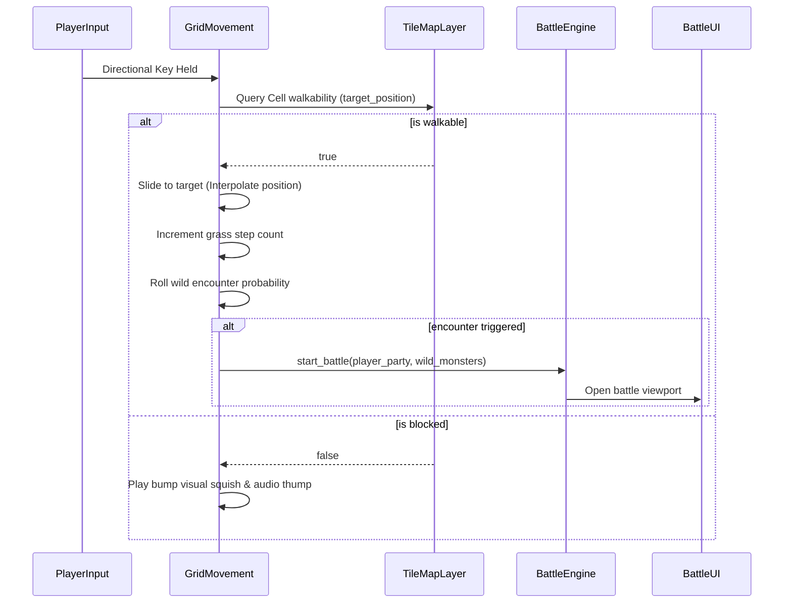
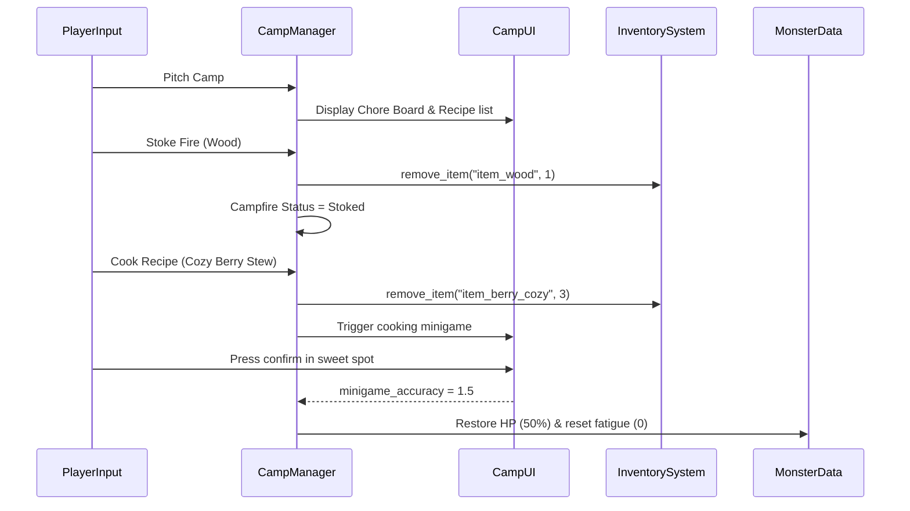
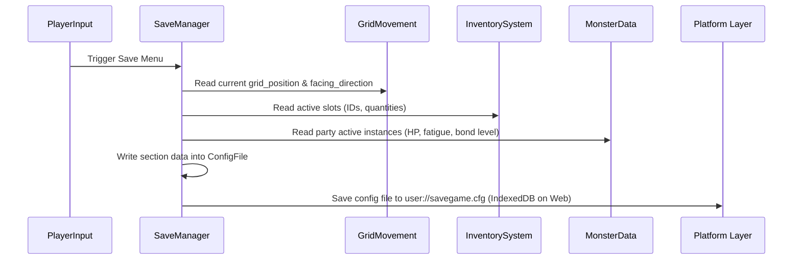

# Hearth & Horn — Master Architecture

## Document Status
- **Version**: 1.0
- **Last Updated**: 2026-05-28
- **Engine**: Godot 4.6.3 (GDScript)
- **GDDs Covered**:
  *   [MonsterData](file:///Users/cation/Game-Studios/design/gdd/monster-data.md)
  *   [InventorySystem](file:///Users/cation/Game-Studios/design/gdd/inventory-system.md)
  *   [GridMovement](file:///Users/cation/Game-Studios/design/gdd/grid-movement.md)
  *   [BattleEngine](file:///Users/cation/Game-Studios/design/gdd/battle-engine.md)
  *   [CampManager](file:///Users/cation/Game-Studios/design/gdd/camp-manager.md)
  *   [BattleUI](file:///Users/cation/Game-Studios/design/gdd/battle-ui.md)
- **ADRs Referenced**:
  *   [ADR-001: Data-Driven Resource Management](file:///Users/cation/Game-Studios/docs/architecture/adr-001-resource-management.md)
  *   [ADR-002: Grid-Based TileMapLayer Structure](file:///Users/cation/Game-Studios/docs/architecture/adr-002-tilemap-layer.md)
  *   [ADR-003: Save/Load State with ConfigFile](file:///Users/cation/Game-Studios/docs/architecture/adr-003-save-load-configfile.md)

---

## Engine Knowledge Gap Summary
*   **Target Engine**: Godot 4.6.3 (Released early 2026, post-LLM training cutoff).
*   **High Risk Domains**:
    *   *Default 3D Physics*: Godot Jolt is now default for new projects. (No impact, as Hearth & Horn is a 2D grid project).
*   **Medium Risk Domains**:
    *   *TileMapLayer Nodes*: Deprecated legacy `TileMap` node in favor of multiple `TileMapLayer` nodes per layer. Grid movement maps must utilize `TileMapLayer` and access individual cell custom data properties.
*   **Low Risk Domains**:
    *   Static typing rules, custom Resource definitions, and standard `Control` UI node containers.

---

## System Layer Map

Every game system is categorized into one of five architectural layers:

```
┌─────────────────────────────────────────────┐
│  PRESENTATION LAYER                         │  ← BattleUI, CampUI, Exploration HUD
├─────────────────────────────────────────────┤
│  FEATURE LAYER                              │  ← CampManager, WildAI, BondManager
├─────────────────────────────────────────────┤
│  CORE LAYER                                 │  ← GridMovement, BattleEngine
├─────────────────────────────────────────────┤
│  FOUNDATION LAYER                           │  ← MonsterData, InventorySystem, SaveManager
├─────────────────────────────────────────────┤
│  PLATFORM LAYER                             │  ← Godot 4.6.3 Engine API (WebGL2/PC)
└─────────────────────────────────────────────┘
```

1.  **Presentation Layer**: Responsible for rendering game state to the player and capturing inputs. Includes `BattleUI` (AP crystal meters, move wheels, floating damage texts), `CampUI` (cooking sliders, chore boards), and `Exploration HUD` (backpack grids).
2.  **Feature Layer**: Governs mid-tier loops. Contains `CampManager` (calculating cooking minigame scores and campfire fuel decay), `WildAI` (enemy target/stance decisions), and `BondManager` (relationship XP).
3.  **Core Layer**: Implements foundational gameplay mechanics. Contains `GridMovement` (tile-by-tile cardinal translations, collision layer validation, grass step encounter tracking) and `BattleEngine` (2v2 active turn loops, AP budget allocation, stance triangle resolution).
4.  **Foundation Layer**: Defines data formats, templates, and persistence. Contains custom templates (`MonsterData`, `ItemData`), mutable containers (`Inventory`), and save file utilities (`SaveManager`).
5.  **Platform Layer**: The Godot 4.6.3 engine runtime, managing IndexedDB files (web exports), rendering pipelines, and raw OS keyboard/controller mappings.

---

## Module Ownership

The following matrix details data ownership, exposed interfaces, and consumed services for each system:

| Module | Owns Data/State | Exposes Interface | Consumes Interfaces |
| :--- | :--- | :--- | :--- |
| **`MonsterData`** | Static templates & mutable active instances (`current_hp`, `fatigue`, `bond_level`) | `duplicate_instance()`, `apply_fatigue()`, `apply_damage()` | None |
| **`InventorySystem`** | Backpack slot arrays (`InventorySlot[]`) | `add_item()`, `remove_item()`, `has_item()`, `sort_inventory()` | Read-only `ItemData` |
| **`GridMovement`** | Character map coordinates (`Vector2i`) | `grid_position`, `facing_direction`, `move_to_tile()` | `TileMapLayer` cell data |
| **`BattleEngine`** | Combat turn phases, AP budget | `start_battle()`, `confirm_actions()`, `round_ap` | `MonsterData` stats, `WildAI` moves |
| **`CampManager`** | Campfire fuel timers, shelf storage | `pitch_camp()`, `stoke_fire()`, `cook_recipe()` | `InventorySystem` items, `MonsterData` roles |
| **`SaveManager`** | Serialized save dictionaries | `save_game()`, `load_game()` | `InventorySystem` slots, `MonsterData` stats, `GridMovement` positions |

---

## Data Flow

### 1. Exploration step to combat encounter


### 2. Camp Resting and Cooking Recovery


### 3. Save Game Persistence Flow


---

## API Boundaries

### 1. Custom Resources (Foundation Layer)
```gdscript
# ItemData: Read-only template
class_name ItemData
extends Resource

@export var item_id: String
@export var display_name: String
@export var description: String
@export_enum("Ingredient", "Fuel", "Consumable", "Utility") var category: String
@export var max_stack: int = 99
@export var weight: float = 0.1
@export var camp_value: float = 0.0
@export var icon: Texture2D
```

```gdscript
# MonsterData: Templates duplicated for active instances
class_name MonsterData
extends Resource

@export_group("Identity")
@export var monster_id: String
@export var display_name: String
@export var monster_race: String
@export_enum("Grass", "Fire", "Water", "Normal") var elemental_type: String

@export_group("Base Stats")
@export var base_hp: int = 50
@export var base_attack: int = 10
@export var base_defense: int = 10
@export var base_speed: int = 1  # Action Points contributed (1-3)

@export_group("Campsite Chore Utility")
@export_enum("Fire-Starter", "Water-Purifier", "Gatherer", "Warder") var camp_role: String
@export var work_efficiency: float = 1.0

# Runtime mutable state (must be initialized on .duplicate())
var current_hp: int
var fatigue: int = 0
var bond_level: int = 0
var bond_xp: int = 0

func initialize_runtime_state() -> void:
    current_hp = base_hp
    fatigue = 0
    bond_level = 0
    bond_xp = 0
```

### 2. Backpack Container (Foundation Layer)
```gdscript
# InventorySlot: Container holding reference and mutable count
class_name InventorySlot
extends RefCounted

var item_data: ItemData
var quantity: int = 0

func _init(p_item_data: ItemData, p_qty: int) -> void:
    item_data = p_item_data
    quantity = p_qty
```

```gdscript
# Inventory: Handles backing structure
class_name Inventory
extends Resource

@export var max_slots: int = 20
var slots: Array[InventorySlot] = []

func add_item(item_data: ItemData, amount: int) -> int:
    # Auto-stacks and opens new slots if needed. Returns leftovers.
    pass

func remove_item(item_id: String, amount: int) -> bool:
    # Deducts count across slots. Returns success.
    pass
```

---

## ADR Audit

| ADR | Engine Compat | Version | GDD Linkage | Conflicts | Status |
| :--- | :--- | :--- | :--- | :--- | :--- |
| **ADR-001**: Resource Management | Pinned | 4.6.3 | [MonsterData](file:///Users/cation/Game-Studios/design/gdd/monster-data.md) | None | Accepted |
| **ADR-002**: TileMapLayer Grid | Pinned | 4.6.3 | [GridMovement](file:///Users/cation/Game-Studios/design/gdd/grid-movement.md) | None | Accepted |
| **ADR-003**: ConfigFile Save | Pinned | 4.6.3 | [InventorySystem](file:///Users/cation/Game-Studios/design/gdd/inventory-system.md) | None | Accepted |

---

## Required ADRs
1.  **`docs/architecture/adr-001-resource-management.md`**: Defines how game templates are mapped as Resources and duplicated upon instantiation to guarantee memory safety.
2.  **`docs/architecture/adr-002-tilemap-layer.md`**: Defines the utilization of the modern Godot 4.6 `TileMapLayer` and cell properties queries for collision and grass encounter loops.
3.  **`docs/architecture/adr-003-save-load-configfile.md`**: Outlines save game persistence using Godot's built-in `ConfigFile` module mapping directly to IndexedDB.

---

## Architecture Principles
*   **Strict Static Typing**: All GDScript declarations must use explicit static typing (e.g. `var speed: int = 1`, `func action() -> void`) to catch bugs at compile time and optimize performance.
*   **Decoupled Signal Messaging**: Avoid tight system couplings. Core systems must signal changes (e.g., `signal fatigue_updated(new_value)`) allowing presentation layers (`BattleUI`) to subscribe dynamically.
*   **Visual-Frame Outline Integrity**: Character outlines on screen visual nodes must enforce Dark Earth Brown (`#3C2010`) outlines instead of pure black.
*   **Forgiving Recovery Bounds**: Defeat states must never delete progress; player positions and HP are written safely back to the last visited campsite.

---

## Open Questions

| ID | Summary | Priority | Resolution Path |
| :--- | :--- | :--- | :--- |
| **QQ-01** | Should we allow separate profiles or a single save slot? | Low | **ADR-003**: Resolve as a single-slot save system (`savegame.cfg`) to minimize UI layout complexity for children. |
